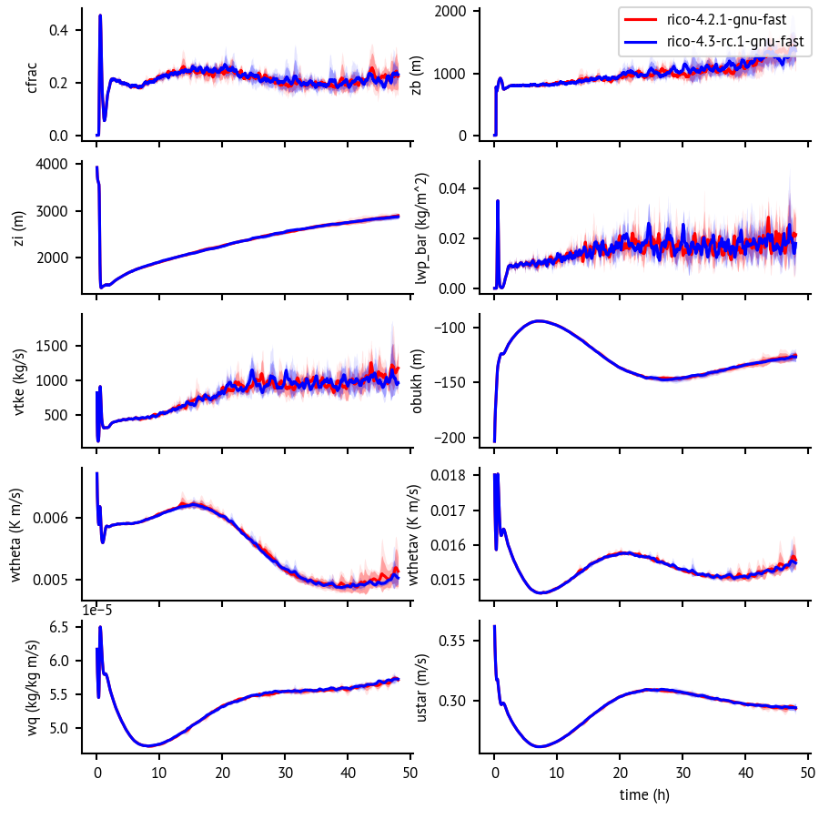

Dales tester
============

Test cases and script for [DALES](https://github.com/dalesteam/dales)

Idea: run a set of cases with different DALES versions.
For each case and version, run an ensemble with different random seeds.
Plot observables over time from tmser.nnn.nc, as a mean and the standard
deviation, so that one can compare the difference between the
DALES versions with the ensemble spread.

The scripts have been tested on Cartesius, September 2020.



Use
---

```
./clone.sh
./compile.sh 4.3-rc.1
./compile.sh 4.2
./compile.sh 4.1

cd cases/rico

# edit rico.job, change work paths and the TAG variable, according to
# which DALES version to run

# submit an array job for each ensemble
sbatch --array=1-5 rico.job

# when finished, use `dales-ensemble-plot.py` to analyze the results
```

The output directories are organized as `<case_dir>/<run_id>/`,
where case_dir consists of case-$TAG-$SYST.
$TAG is a git version tag or commit, and $SYST is the system selection
which controls the compiler settings for DALES.

